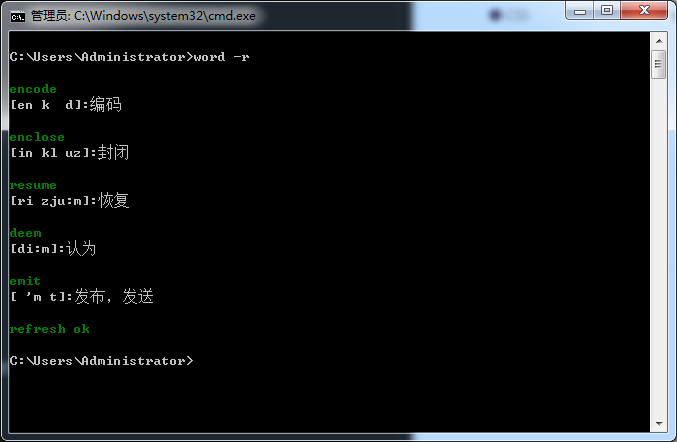
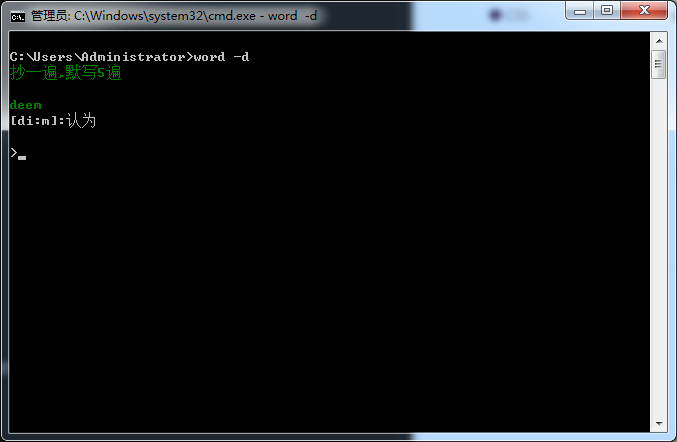
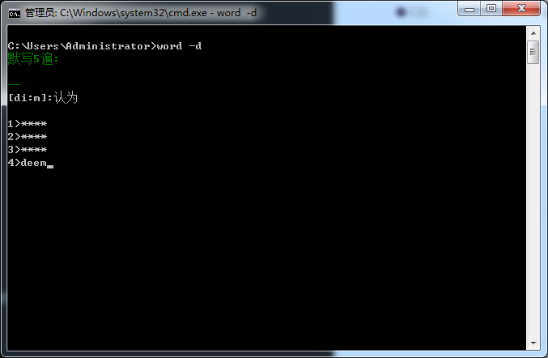
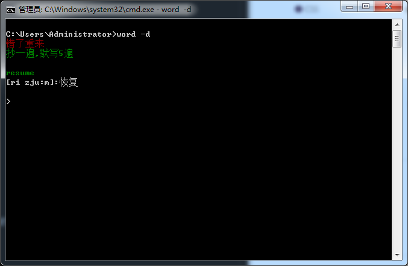
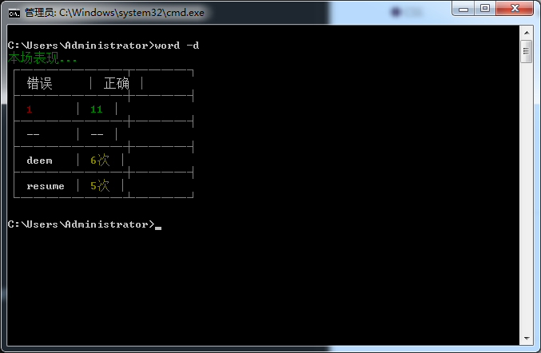
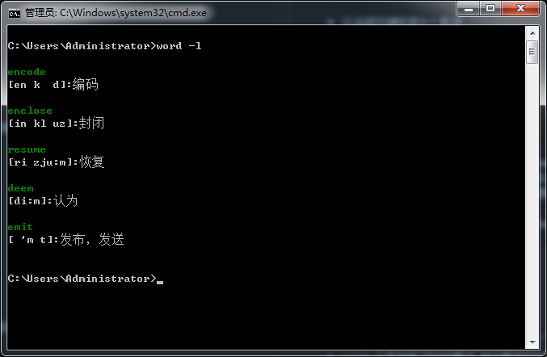

# word-learn
> npm i -g word-learn

    我最近做了一款 nodejs 的命令行工具，帮助开发者学习单词。

```
Usage: index [options]

Options:
  -V, --version    output the version number
  -r, --refresh    更换单词列表: 重新从服务端拉去单词
  -d, --pineapple  开始练习: 抄一遍,默写5遍
  -l, --words      打印单词列表
  -h, --help       output usage information
```

### 功能如下: 

- 从远程拉随机取5个单词
- 随机给出一个单词， 抄一遍默写5遍

### 效果图

## word -r 获取随机单词


## word -d 开始练习，抄一遍


## word -d 开始练习，默写5遍


## word -d 开始练习，默写错误


## word -d 练习结束


## word -l 打印单词列表



## Version
### 1.0.4 （未来版本）
-----
- 实现登录功能，不论是在家还是在公司都能数据同步
- 记录用户每场练习结果，能查询
- word 后不跟任何命令时打印主页

### 1.0.3
-----
- word -d 修改练习时的模式, 输出默写的5条

### 1.0.1
----
- word -d 离开时打印用户行为
  > 正确次数,错误次数, 各个单词的练习次数(输入正确的)
- word -d 练习中出入 -exit 退出练习
  ```
    $ word -d
    抄一遍,默写5遍
    storage:存储
    > -exit
    beybey...
  ```
### 1.0.0
----
- word -l 列出本地所有单词
- word -d 开始练习, 抄一遍,默写5遍
- word -r 从远程拉去单词, 更新到本地
- init


